```R
.libPaths()
```


'/Library/Frameworks/R.framework/Versions/4.0/Resources/library'


## 1. 环境设置


```R
library(R2OpenBUGS)
library(coda)
library(deSolve)
library(ggplot2)
library(lattice)
```


```R
library(reshape2)
```


```R
library(gganimate)
# library(chron)
```


```R
fig <- function(width, heigth){
     options(repr.plot.width = width, repr.plot.height = heigth)
}
```

## 2. 读取患者实际数据


```R
pat_data <- read.csv(file="diabetes_case1.csv", header=T)
```


```R
head(pat_data)
```


<table>
<caption>A data.frame: 6 × 8</caption>
<thead>
	<tr><th></th><th scope=col>date</th><th scope=col>time_relative</th><th scope=col>time_accu</th><th scope=col>time_in_day</th><th scope=col>Metformin</th><th scope=col>DPP_4</th><th scope=col>Glu</th><th scope=col>meal</th></tr>
	<tr><th></th><th scope=col>&lt;int&gt;</th><th scope=col>&lt;dbl&gt;</th><th scope=col>&lt;dbl&gt;</th><th scope=col>&lt;dbl&gt;</th><th scope=col>&lt;int&gt;</th><th scope=col>&lt;int&gt;</th><th scope=col>&lt;dbl&gt;</th><th scope=col>&lt;int&gt;</th></tr>
</thead>
<tbody>
	<tr><th scope=row>1</th><td>7</td><td>0.0</td><td> 8.0</td><td> 8.0</td><td>500</td><td>100</td><td> 0.0</td><td>130</td></tr>
	<tr><th scope=row>2</th><td>7</td><td>0.5</td><td> 8.5</td><td> 8.5</td><td>  0</td><td>  0</td><td> 0.0</td><td>  0</td></tr>
	<tr><th scope=row>3</th><td>7</td><td>3.5</td><td>11.5</td><td>11.5</td><td>500</td><td>  0</td><td> 0.0</td><td>130</td></tr>
	<tr><th scope=row>4</th><td>7</td><td>4.0</td><td>12.0</td><td>12.0</td><td>  0</td><td>  0</td><td>12.6</td><td>  0</td></tr>
	<tr><th scope=row>5</th><td>7</td><td>9.0</td><td>17.0</td><td>17.0</td><td>  0</td><td>  0</td><td> 0.0</td><td>130</td></tr>
	<tr><th scope=row>6</th><td>7</td><td>9.5</td><td>17.5</td><td>17.5</td><td>  0</td><td>  0</td><td> 0.0</td><td>  0</td></tr>
</tbody>
</table>


```R
t_obv<-pat_data$time_relative
metformin_dosing<-pat_data$Metformin
dpp4_dosing<-pat_data$DPP_4
meal_dosing<-pat_data$meal
```

## 3. 理论参数模型

### 3.1. 单次给药模拟


```R
## 理论参数

#sitagliptin
Ka_sita <- 1.64 #(/h)
Kqf_sita<-11.1 #(L/h)
Vcf_sita<-266 #(L)
Vpf_sita<-101
CLf_sita<-39.1 #(L/h)
Emax_sita<-100 #(100% inh)
EC50_sita<-12.9 #(ng/mL)
gamma_sita<-0.823

#metformin
Ka_met<-0.41 #(/h)
V_met<-113 #(L)
CLf_met<-52.9 #(L/h)
Emax_met<-19.8 #(ug/mL? mg/dL)
EC50_met<-3.68 #(ug/mL)
tau_met<-0.5 #(h)
gamma_met<-0.55

#meal
Ktr_glu<-6.9 #(/h)
Ka_glu<-0.892 #(/h)
Vdf_glu<-19.1 #(L)
CLf_glu<-83.7 #(L/h)
base_glu<-82.9 #(mg/dL)
```


```R

```


```R
## ODE
## 间接效应PK-PD模型
PKPD <- function(t, y, parms) {
    #sitagliptin
    dx1_si_dt <- -Ka_sita*y[1] #y1 x1_si
    dx2_si_dt <- Ka_sita*y[1]-CLf_sita*y[2]/Vcf_sita- Kqf_sita*y[2]/Vcf_sita+Kqf_sita*y[3]/Vpf_sita #y2 x2_si
    dx3_si_dt <- Kqf_sita*y[2]/Vcf_sita-Kqf_sita*y[3]/Vpf_sita #y3 x3_si
    Cp_si <- y[2]*1000/Vcf_sita
    E_si <- Emax_sita*Cp_si^gamma_sita/(EC50_sita^gamma_sita+Cp_si^gamma_sita)
    
    #metformin
    dx1_met_dt <- -Ka_met*y[4] #y4 x1_met
    dx2_met_dt <- Ka_met*y[4]-CLf_met*y[5]/V_met #y[5] x2_met
    Cp_met <- y[5]/V_met
    DR_met <- Emax_met*Cp_met^gamma_met/(EC50_met^gamma_met+Cp_met^gamma_met)
    dm1_dt <- (DR_met-y[6])/tau_met #y[6] m1
    dm2_dt <- (y[6]-y[7])/tau_met #y[7] m2
    dm3_dt <- (y[7]-y[8])/tau_met #y[8] m3
    
    #glu
    dx1_glu_dt <- -Ktr_glu*y[9] #y[9] x1_glu
    dx2_glu_dt <- Ktr_glu*y[9]-Ktr_glu*y[10] #y[10] x2_glu
    dx3_glu_dt <- Ktr_glu*y[10]-Ka_glu*y[11] #y[11] x3_glu
    dx4_glu_dt <- Ka_glu*y[11]-CLf_glu*(1+E_si/100)*y[12]/Vdf_glu #y[8]*Vdf_glu*10/1000 #y[12] x4_glu (g/L)
    
    list(c(dx1_si_dt,dx2_si_dt,dx3_si_dt,dx1_met_dt,dx2_met_dt,dm1_dt,dm2_dt,dm3_dt,dx1_glu_dt,dx2_glu_dt,dx3_glu_dt,dx4_glu_dt))
  }
yini <- c(x1s=100,x2s=0,x3s=0,x1m=500,x2m=0,m1m=0,m2m=0,m3m=0,x1g=130,x2g=0,x3g=0,x4g=0) #ng/mL  base_glu*Vdf_glu*10/1000
times <- seq(from = 10, to = 24, by = 1)
out_st <- ode(times = times, y = yini, func = PKPD, parms = NULL)
```


```R
head(out_st,n=3)
```


<table>
<caption>A matrix: 3 × 13 of type dbl</caption>
<thead>
	<tr><th scope=col>time</th><th scope=col>x1s</th><th scope=col>x2s</th><th scope=col>x3s</th><th scope=col>x1m</th><th scope=col>x2m</th><th scope=col>m1m</th><th scope=col>m2m</th><th scope=col>m3m</th><th scope=col>x1g</th><th scope=col>x2g</th><th scope=col>x3g</th><th scope=col>x4g</th></tr>
</thead>
<tbody>
	<tr><td>10</td><td>100.000000</td><td> 0.00000</td><td>0.000000</td><td>500.0000</td><td>  0.0000</td><td>0.000000</td><td>0.000000</td><td>0.000000</td><td>1.300000e+02</td><td>0.000000000</td><td> 0.000000</td><td>0.000000</td></tr>
	<tr><td>11</td><td> 19.398004</td><td>71.72509</td><td>1.900139</td><td>331.8251</td><td>132.1688</td><td>5.175841</td><td>3.096146</td><td>1.494576</td><td>1.310118e-01</td><td>0.903983238</td><td>18.076645</td><td>8.952104</td></tr>
	<tr><td>12</td><td>  3.762826</td><td>73.62275</td><td>4.655317</td><td>220.2158</td><td>170.4733</td><td>7.108571</td><td>6.157482</td><td>4.777024</td><td>1.320436e-04</td><td>0.001822093</td><td> 0.980394</td><td>0.539942</td></tr>
</tbody>
</table>


```R
tail(out_st,n=3)
```


<table>
<caption>A matrix: 3 × 13 of type dbl</caption>
<thead>
	<tr><th></th><th scope=col>time</th><th scope=col>x1s</th><th scope=col>x2s</th><th scope=col>x3s</th><th scope=col>x1m</th><th scope=col>x2m</th><th scope=col>m1m</th><th scope=col>m2m</th><th scope=col>m3m</th><th scope=col>x1g</th><th scope=col>x2g</th><th scope=col>x3g</th><th scope=col>x4g</th></tr>
</thead>
<tbody>
	<tr><th scope=row>[13,]</th><td>22</td><td>2.849233e-07</td><td>16.76539</td><td>9.865847</td><td>3.649553</td><td>12.926349</td><td>2.793573</td><td>3.036323</td><td>3.291475</td><td> 4.070881e-13</td><td>-1.444188e-11</td><td> 2.467113e-11</td><td>-2.768051e-09</td></tr>
	<tr><th scope=row>[14,]</th><td>23</td><td>5.526903e-08</td><td>14.84956</td><td>9.461981</td><td>2.422025</td><td> 9.058738</td><td>2.360891</td><td>2.577179</td><td>2.806625</td><td>-9.181496e-12</td><td> 4.544221e-10</td><td>-7.784162e-10</td><td> 1.769147e-07</td></tr>
	<tr><th scope=row>[15,]</th><td>24</td><td>1.074113e-08</td><td>13.22121</td><td>9.030412</td><td>1.607375</td><td> 6.312493</td><td>1.981293</td><td>2.171146</td><td>2.374161</td><td>-6.590232e-11</td><td> 2.986291e-09</td><td>-5.097997e-09</td><td>-8.884230e-07</td></tr>
</tbody>
</table>


```R
out_st_df <- as.data.frame(out_st)
```


```R
E_t_st <- ggplot(aes(x = time),data=out_st_df) +
  geom_line(aes(y = x3g,colour = "blue"),show.legend = TRUE) +
  geom_line(aes(y = x4g, colour = "green")) +
#   geom_point(aes(x = grid, y = r_score, colour = "red"), data=out_real, show.legend = TRUE) + 
#   ylab(label = "Effects_Score") +
#   xlab(label = "Time(min)") +
#   scale_colour_manual(name = "Effects",
#                       labels = c("Pop", "Ind"),
#                       values = c("red", "blue")) + 
#   transition_reveal(time)+
#   coord_cartesian(xlim = c(-10, 250)) + 
  theme_bw()
```


```R
E_t_st
```


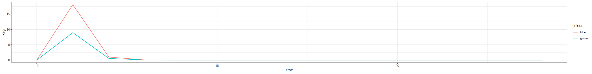


### 3.2. 多次给药模拟


```R
mult_drug_dosing<-function(time_seq,metformin_seq,DPP4_seq,meal_seq){
    n=length(time_seq)-1
    
    for (i in 1:n){
        
        times <- seq(from = time_seq[i], to = time_seq[i+1], by = (time_seq[i+1]-time_seq[i])/10)
        
        if (i==1){
            
            
            yini <- c(x1s=DPP4_seq[i],x2s=0,x3s=0,x1m=metformin_seq[i],x2m=0,m1m=0,m2m=0,m3m=0,x1g=meal_seq[i],x2g=0,x3g=0,x4g=0) #ng/mL  base_glu*Vdf_glu*10/1000

            out_st <- ode(times = times, y = yini, func = PKPD, parms = NULL)
            df <- as.data.frame(out_st)
#             print(df)
        } else {
            
            yini <- out_st[dim(out_st)[1],c(2:dim(out_st)[2])]
            yini['x1s']<-yini['x1s']+DPP4_seq[i]
            yini['x1m']<-yini['x1m']+metformin_seq[i]
            yini['x1g']<-yini['x1g']+meal_seq[i]
            
            
#             print(yini)
            
            out_st <- ode(times = times, y = yini, func = PKPD, parms = NULL)
            
            temp_df <- as.data.frame(out_st)
            
            
            df<-rbind(df[0:(dim(df)[1]-1),],temp_df)
        }
    }
    return(df)
}
```


```R
EC50_sita<-12.2
```


```R
dftest<-mult_drug_dosing(time_seq=t_obv,metformin_seq=metformin_dosing,DPP4_seq=dpp4_dosing,meal_seq=meal_dosing)
```


```R
dftest$x4g<-dftest$x4g-dftest$m3m*Vdf_glu*10/1000
```


```R
dftest[dftest$time==432.0,]
```


<table>
<caption>A data.frame: 1 × 13</caption>
<thead>
	<tr><th></th><th scope=col>time</th><th scope=col>x1s</th><th scope=col>x2s</th><th scope=col>x3s</th><th scope=col>x1m</th><th scope=col>x2m</th><th scope=col>m1m</th><th scope=col>m2m</th><th scope=col>m3m</th><th scope=col>x1g</th><th scope=col>x2g</th><th scope=col>x3g</th><th scope=col>x4g</th></tr>
	<tr><th></th><th scope=col>&lt;dbl&gt;</th><th scope=col>&lt;dbl&gt;</th><th scope=col>&lt;dbl&gt;</th><th scope=col>&lt;dbl&gt;</th><th scope=col>&lt;dbl&gt;</th><th scope=col>&lt;dbl&gt;</th><th scope=col>&lt;dbl&gt;</th><th scope=col>&lt;dbl&gt;</th><th scope=col>&lt;dbl&gt;</th><th scope=col>&lt;dbl&gt;</th><th scope=col>&lt;dbl&gt;</th><th scope=col>&lt;dbl&gt;</th><th scope=col>&lt;dbl&gt;</th></tr>
</thead>
<tbody>
	<tr><th scope=row>1081</th><td>432</td><td>100</td><td>6.155877</td><td>6.066891</td><td>500.1385</td><td>0.6907172</td><td>0.6340298</td><td>0.7057402</td><td>0.7848357</td><td>520</td><td>-1.052885e-14</td><td>0.001068613</td><td>-0.02157555</td></tr>
</tbody>
</table>


```R
pat_data[pat_data$time_relative==432.0,]
```


<table>
<caption>A data.frame: 1 × 9</caption>
<thead>
	<tr><th></th><th scope=col>date</th><th scope=col>time_relative</th><th scope=col>time_accu</th><th scope=col>time_in_day</th><th scope=col>Metformin</th><th scope=col>DPP_4</th><th scope=col>Glu</th><th scope=col>meal</th><th scope=col>Glu_g</th></tr>
	<tr><th></th><th scope=col>&lt;int&gt;</th><th scope=col>&lt;dbl&gt;</th><th scope=col>&lt;dbl&gt;</th><th scope=col>&lt;dbl&gt;</th><th scope=col>&lt;int&gt;</th><th scope=col>&lt;int&gt;</th><th scope=col>&lt;dbl&gt;</th><th scope=col>&lt;int&gt;</th><th scope=col>&lt;dbl&gt;</th></tr>
</thead>
<tbody>
	<tr><th scope=row>109</th><td>25</td><td>432</td><td>440</td><td>8</td><td>500</td><td>100</td><td>7</td><td>130</td><td>4.966</td></tr>
</tbody>
</table>


```R
##生成实际血糖升高值的观察数据，以备后续拟合
pat_data$Glu_g=pat_data$Glu*180*Vdf_glu/1000-100*Vdf_glu*10/1000 #(g,mmol/L->mg/L->g/L->g;)
pat_data$Glu_g[pat_data$Glu_g<0]<-0
```


```R
fig(24,3)

CpCe_trend <- ggplot(dftest,aes(x = time)) +
  geom_line(aes(y = x3s), colour = "darkgreen") +
  geom_line(aes(y = m3m), colour = "orange") +
  ylab(label = "Concentation(ng/mL)") +
  xlab(label = "Time(min)") +
#   scale_colour_manual(name = "Effects",
#                       labels = c("Pop", "Ind"),
#                       values = c("red", "blue")) + 
  theme_bw()
CpCe_trend

E_trend <- ggplot(dftest,aes(x = time)) +
  geom_line(aes(y = x4g), colour = "red") +
#   geom_line(aes(y = Ce, colour = "green")) +
  geom_point(aes(x = time_relative, y = Glu_g), pat_obs_data, colour = "blue", show.legend = FALSE) + 
  ylab(label = "Effects_Score") +
  xlab(label = "Time(min)") +
#   scale_colour_manual(name = "Effects",
#                       labels = c("Pop", "Ind"),
#                       values = c("red", "blue")) + 
  theme_bw()
E_trend
```


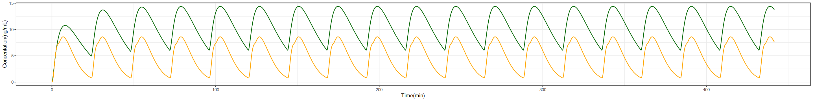


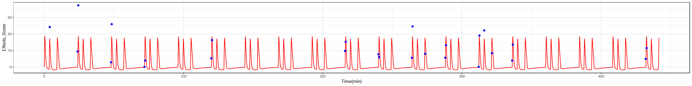


## 4. 个性化参数推导

### 4.1. MCMC建模


```R
model <-    
paste(" 
model {
    
    # loop over time grid 
    for (j in 1:n.grid) {      
        equ_x[j]<-a.language[j, 12]-a.language[j, 8]*Vdf_glu*10/1000
        obs_x[j] ~ dnorm(equ_x[j] , tau.x)                           	    
    }           

    # parameters 

    #sitagliptin
    Ka_sita <- 1.64
    Kqf_sita<-11.1
    Vcf_sita<-266
    Vpf_sita<-101
    CLf_sita<-39.1
    Emax_sita<-100
    EC50_sita ~ dunif(0,24) 
    #EC50_sita<-12.9
    gamma_sita<-0.823

    #metformin
    Ka_met<-0.41
    V_met<-113
    CLf_met<-52.9
    Emax_met ~ dunif(0,40)
    #Emax_met<-19.8
    EC50_met<-3.68
    tau_met<-0.5
    gamma_met<-0.55

    #meal
    Ktr_glu<-6.9
    #Ka_glu<-0.892
    Ka_glu ~ dunif(0,10)
    Vdf_glu<-19.1
    CLf_glu<-83.7
    base_glu<-82.9

    # ODE solutions
    a.language[1:n.grid, 1:dim] <- 
        ode.block(inits[1:n.block, 1:dim], 
            grid[1:n.grid],                      
            D(C[1:dim], t),                      
            origins[1:n.block], tol)
    #sitagliptin
    D(C[1], t) <- -Ka_sita*C[1]
    D(C[2], t) <- Ka_sita*C[1]-CLf_sita*C[2]/Vcf_sita- Kqf_sita*C[2]/Vcf_sita+Kqf_sita*C[3]/Vpf_sita 
    D(C[3], t) <- Kqf_sita*C[2]/Vcf_sita-Kqf_sita*C[3]/Vpf_sita
    Cp_si <- C[2]*1000/Vcf_sita
    E_si <- Emax_sita*pow(Cp_si,gamma_sita)/(pow(EC50_sita,gamma_sita)+pow(Cp_si,gamma_sita))

    #metformin
    D(C[4], t) <- -Ka_met*C[4]
    D(C[5], t) <- Ka_met*C[4]-CLf_met*C[5]/V_met
    Cp_met <- C[5]/V_met
    DR_met <- Emax_met*pow(Cp_met,gamma_met)/(pow(EC50_met,gamma_met)+pow(Cp_met,gamma_met))
    D(C[6], t) <- (DR_met-C[6])/tau_met
    D(C[7], t) <- (C[6]-C[7])/tau_met
    D(C[8], t) <- (C[7]-C[8])/tau_met

    #glu
    D(C[9], t) <- -Ktr_glu*C[9]
    D(C[10], t) <- Ktr_glu*C[9]-Ktr_glu*C[10]
    D(C[11], t) <- Ktr_glu*C[10]-Ka_glu*C[11]
    D(C[12], t) <- Ka_glu*C[11]-CLf_glu*(1+E_si/100)*C[12]/Vdf_glu #-C[8]*Vdf_glu*10/1000


    tau.x <- 1/var.x
    var.x <- 1/(sd.x*sd.x)
    sd.x ~ dunif(0, 5)
}
")
writeLines(model,"metformin_sitagliptin_model.txt")   

```

### 4.2. 模型拟合个体参数


```R
### prepare dosing data
pat_data$dose_sum<-pat_data$Metformin+pat_data$DPP_4+pat_data$meal

pat_dose_data<-pat_data[pat_data$dose_sum>0,c('time_relative','Metformin','DPP_4','meal')]

pat_dose_data[,c('2','3','5','6','7','8','10','11','12')]<-0

pat_dose_data<-pat_dose_data[,c('time_relative','Metformin','2','3','DPP_4','5','6','7','8','meal','10','11','12')]
```


```R
### prepare obs data
pat_obs_data<-pat_data[pat_data$Glu_g>0,c('time_relative','Glu_g')]
```


```R
bugs_data <- list(
    dim = 12,
    tol = 1.0E-3,

    n.grid=26,
    n.block=57,

    inits = data.matrix(pat_dose_data[,c('Metformin','2','3','DPP_4','5','6','7','8','meal','10','11','12')]),

    origins = pat_dose_data$time_relative,
    
    grid = pat_obs_data$time_relative,
    obs_x= pat_obs_data$Glu_g
)
```


```R
init1 <- list(
  EC50_sita = runif(1, 0, 20), 
  Emax_met = runif(1, 0, 40), 
  Ka_glu = runif(1,0, 10),
#   E = runif(1, 36, 56), 
#   Emax = runif(1,700, 900),
#   gamma = runif(1,1, 15),
  sd.x = 1)
init2 <- list(
  EC50_sita = runif(1, 0, 20), 
  Emax_met = runif(1, 0, 40), 
  Ka_glu = runif(1,0, 10),
#   E = runif(1, 36, 56), 
#   Emax = runif(1,700, 900),
#   gamma = runif(1,1, 15),
  sd.x = 4)
inits <- list(init1,init2)
```


```R
parameters <- c('EC50_sita','Emax_met','Ka_glu')
```


```R
diabetes.sim <- bugs(
  data = bugs_data, 
  inits = inits, 
  codaPkg = TRUE,
  model.file = 'metformin_sitagliptin_model.txt', 
  parameters=parameters, 
  n.chains = 2, 
  n.iter = 2000, 
  n.burnin = 300,
  useWINE = TRUE, 
  OpenBUGS.pgm = "/Users/esther/.wine/drive_c/Program Files/OpenBUGS/OpenBUGS323/OpenBUGS.exe",
  WINE = "/Applications/Wine.app/Contents/Resources/wine/bin/wine", 
  WINEPATH = "/Applications/Wine.app/Contents/Resources/wine/bin/winepath",
  working.directory = getwd(),
  debug=TRUE)
```

    arguments 'show.output.on.console', 'minimized' and 'invisible' are for Windows only
    


### 4.3. 拟合结果


```R
fig(8,8)
```


```R
out.coda <- read.bugs(diabetes.sim)
xyplot(out.coda)
```

    Abstracting EC50_sita ... 1700 valid values
    Abstracting Emax_met ... 1700 valid values
    Abstracting Ka_glu ... 1700 valid values
    Abstracting deviance ... 1700 valid values
    Abstracting EC50_sita ... 1700 valid values
    Abstracting Emax_met ... 1700 valid values
    Abstracting Ka_glu ... 1700 valid values
    Abstracting deviance ... 1700 valid values


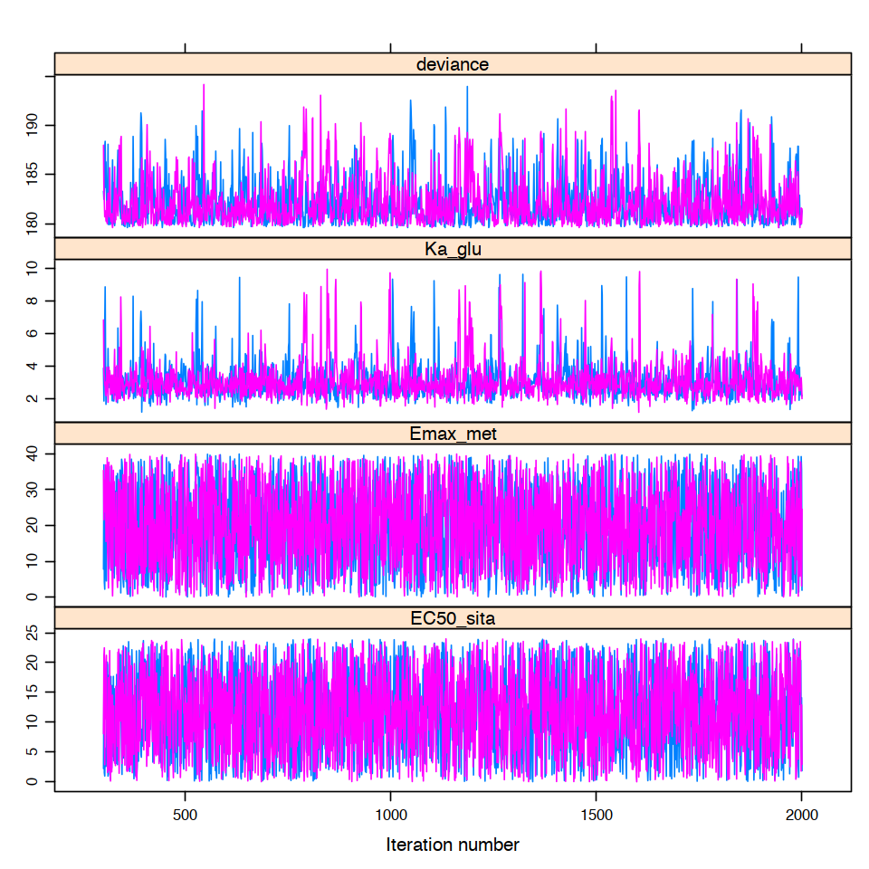


```R
densityplot(out.coda) 
```


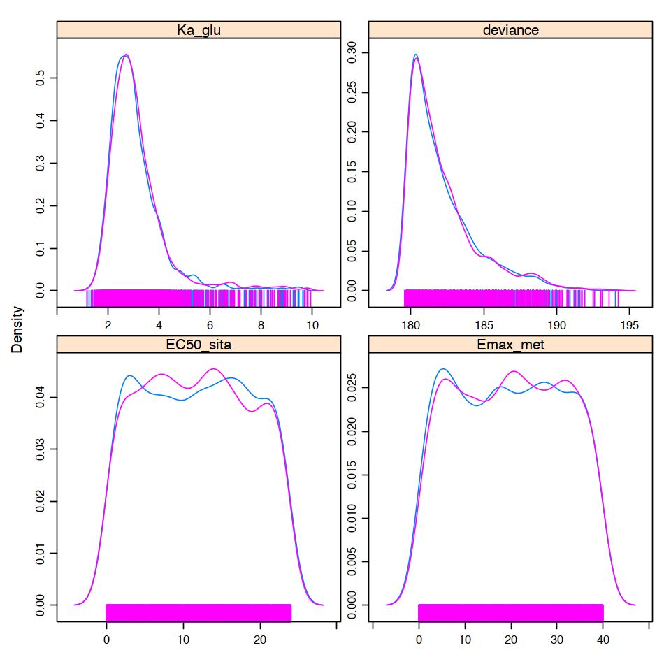


```R
gelman.diag(out.coda) 
```


    Potential scale reduction factors:
    
              Point est. Upper C.I.
    EC50_sita          1       1.00
    Emax_met           1       1.00
    Ka_glu             1       1.01
    deviance           1       1.00
    
    Multivariate psrf
    
    1


```R
out.summary <- summary(out.coda, q = c(0.025, 0.975))
out.summary
```


    
    Iterations = 301:2000
    Thinning interval = 1 
    Number of chains = 2 
    Sample size per chain = 1700 
    
    1. Empirical mean and standard deviation for each variable,
       plus standard error of the mean:
    
                 Mean     SD Naive SE Time-series SE
    EC50_sita  11.790  6.898  0.11831        0.12466
    Emax_met   19.776 11.573  0.19848        0.19849
    Ka_glu      3.118  1.161  0.01990        0.03285
    deviance  182.160  2.389  0.04097        0.07243
    
    2. Quantiles for each variable:
    
                  2.5%   97.5%
    EC50_sita   0.5141  23.230
    Emax_met    0.8441  38.930
    Ka_glu      1.7820   6.621
    deviance  179.8000 188.600


### 4.4. 结果验证

#### 4.4.1 更新参数


```R
EC50_sita <- out.summary$statistics[,'Mean']['EC50_sita']
# K <- 0.81/60
Emax_met <- out.summary$statistics[,'Mean']['Emax_met']
# Ke0 <- 0.95/60
Ka_glu <-out.summary$statistics[,'Mean']['Ka_glu']
# Ec50 <- 600
# gamma <- 7

# yini <- c(Cp = 3000, Ce = 0)
# times <- seq(from = 0, to = 240, by = 1)

```


```R
df_post<-mult_drug_dosing(time_seq=t_obv,metformin_seq=metformin_dosing,DPP4_seq=dpp4_dosing,meal_seq=meal_dosing)
```


```R
df_post$x4g<-df_post$x4g-df_post$m3m*Vdf_glu*10/1000
```


```R
fig(24,3)

CpCe_trend <- ggplot(df_post,aes(x = time)) +
  geom_line(aes(y = x3s), colour = "darkgreen") +
  geom_line(aes(y = m3m), colour = "orange") +
  ylab(label = "Drug Effect(ng/mL)") +
  xlab(label = "Time(h)") +
#   scale_colour_manual(name = "Effects",
#                       labels = c("Pop", "Ind"),
#                       values = c("red", "blue")) + 
  theme_bw()
CpCe_trend

E_trend <- ggplot(df_post,aes(x = time)) +
  geom_line(aes(y = x4g), colour = "red") +
#   geom_line(aes(y = Ce, colour = "green")) +
  geom_point(aes(x = time_relative, y = Glu_g), pat_obs_data, colour = "blue", show.legend = FALSE) + 
  ylab(label = "Glu") +
  xlab(label = "Time(h)") +
#   scale_colour_manual(name = "Effects",
#                       labels = c("Pop", "Ind"),
#                       values = c("red", "blue")) + 
  theme_bw()
E_trend
```


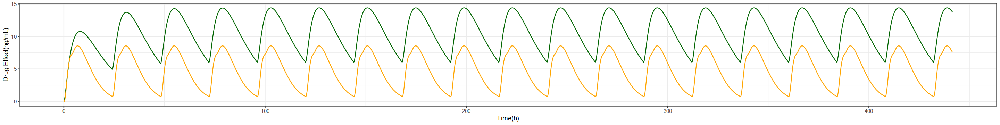


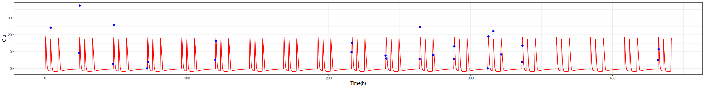


### 4.5. 生成预测值


```R
pat_data_pred <- read.csv(file="diabetes_case1_pred.csv", header=T)
```


```R
head(pat_data_pred,n=3)
```


<table>
<caption>A data.frame: 3 × 9</caption>
<thead>
	<tr><th></th><th scope=col>date</th><th scope=col>time_relative</th><th scope=col>time_accu</th><th scope=col>time_in_day</th><th scope=col>Metformin</th><th scope=col>DPP_4</th><th scope=col>Glu</th><th scope=col>meal</th><th scope=col>tag</th></tr>
	<tr><th></th><th scope=col>&lt;int&gt;</th><th scope=col>&lt;dbl&gt;</th><th scope=col>&lt;dbl&gt;</th><th scope=col>&lt;dbl&gt;</th><th scope=col>&lt;int&gt;</th><th scope=col>&lt;int&gt;</th><th scope=col>&lt;dbl&gt;</th><th scope=col>&lt;int&gt;</th><th scope=col>&lt;chr&gt;</th></tr>
</thead>
<tbody>
	<tr><th scope=row>1</th><td>7</td><td>0.0</td><td> 8.0</td><td> 8.0</td><td>500</td><td>100</td><td>0</td><td>130</td><td>real_data</td></tr>
	<tr><th scope=row>2</th><td>7</td><td>0.5</td><td> 8.5</td><td> 8.5</td><td>  0</td><td>  0</td><td>0</td><td>  0</td><td>real_data</td></tr>
	<tr><th scope=row>3</th><td>7</td><td>3.5</td><td>11.5</td><td>11.5</td><td>500</td><td>  0</td><td>0</td><td>130</td><td>real_data</td></tr>
</tbody>
</table>


```R
t_obv_p<-pat_data_pred$time_relative
metformin_dosing_p<-pat_data_pred$Metformin
dpp4_dosing_p<-pat_data_pred$DPP_4
meal_dosing_p<-pat_data_pred$meal
```


```R
df_pred<-mult_drug_dosing(time_seq=t_obv_p,
                          metformin_seq=metformin_dosing_p,
                          DPP4_seq=dpp4_dosing_p,
                          meal_seq=meal_dosing_p)
```


```R
df_pred$x4g<-df_pred$x4g-df_pred$m3m*Vdf_glu*10/1000
```


```R
tail(df_pred)
```


<table>
<caption>A data.frame: 6 × 13</caption>
<thead>
	<tr><th></th><th scope=col>time</th><th scope=col>x1s</th><th scope=col>x2s</th><th scope=col>x3s</th><th scope=col>x1m</th><th scope=col>x2m</th><th scope=col>m1m</th><th scope=col>m2m</th><th scope=col>m3m</th><th scope=col>x1g</th><th scope=col>x2g</th><th scope=col>x3g</th><th scope=col>x4g</th></tr>
	<tr><th></th><th scope=col>&lt;dbl&gt;</th><th scope=col>&lt;dbl&gt;</th><th scope=col>&lt;dbl&gt;</th><th scope=col>&lt;dbl&gt;</th><th scope=col>&lt;dbl&gt;</th><th scope=col>&lt;dbl&gt;</th><th scope=col>&lt;dbl&gt;</th><th scope=col>&lt;dbl&gt;</th><th scope=col>&lt;dbl&gt;</th><th scope=col>&lt;dbl&gt;</th><th scope=col>&lt;dbl&gt;</th><th scope=col>&lt;dbl&gt;</th><th scope=col>&lt;dbl&gt;</th></tr>
</thead>
<tbody>
	<tr><th scope=row>1366</th><td>537.25</td><td>2.580819e-05</td><td>27.14292</td><td>13.87315</td><td>58.60101</td><td>127.9172</td><td>7.121900</td><td>7.435550</td><td>7.722175</td><td>23.162496</td><td>39.95531</td><td>48.46532</td><td> 9.271616</td></tr>
	<tr><th scope=row>1367</th><td>537.30</td><td>2.377636e-05</td><td>26.96383</td><td>13.85341</td><td>57.41191</td><td>126.1330</td><td>7.088647</td><td>7.404094</td><td>7.693378</td><td>16.404151</td><td>33.95660</td><td>53.25741</td><td>12.253863</td></tr>
	<tr><th scope=row>1368</th><td>537.35</td><td>2.190450e-05</td><td>26.78631</td><td>13.83341</td><td>56.24695</td><td>124.3663</td><td>7.055280</td><td>7.372462</td><td>7.664321</td><td>11.617753</td><td>28.05688</td><td>55.44067</td><td>14.674575</td></tr>
	<tr><th scope=row>1369</th><td>537.40</td><td>2.018000e-05</td><td>26.61034</td><td>13.81316</td><td>55.10563</td><td>122.6171</td><td>7.021807</td><td>7.340660</td><td>7.635009</td><td> 8.227929</td><td>22.70909</td><td>55.50688</td><td>16.420436</td></tr>
	<tr><th scope=row>1370</th><td>537.45</td><td>1.859127e-05</td><td>26.43592</td><td>13.79265</td><td>53.98746</td><td>120.8854</td><td>6.988231</td><td>7.308694</td><td>7.605453</td><td> 5.827187</td><td>18.09342</td><td>53.97282</td><td>17.481457</td></tr>
	<tr><th scope=row>1371</th><td>537.50</td><td>1.712761e-05</td><td>26.26302</td><td>13.77189</td><td>52.89199</td><td>119.1714</td><td>6.954557</td><td>7.276570</td><td>7.575660</td><td> 4.126931</td><td>14.23792</td><td>51.31084</td><td>17.914386</td></tr>
</tbody>
</table>


```R
result<-merge(pat_data_pred,df_pred[,c('time','x4g')],by.x="time_relative",by.y="time",all.x=TRUE)
```


```R
head(result)
```


<table>
<caption>A data.frame: 6 × 10</caption>
<thead>
	<tr><th></th><th scope=col>time_relative</th><th scope=col>date</th><th scope=col>time_accu</th><th scope=col>time_in_day</th><th scope=col>Metformin</th><th scope=col>DPP_4</th><th scope=col>Glu</th><th scope=col>meal</th><th scope=col>tag</th><th scope=col>x4g</th></tr>
	<tr><th></th><th scope=col>&lt;dbl&gt;</th><th scope=col>&lt;int&gt;</th><th scope=col>&lt;dbl&gt;</th><th scope=col>&lt;dbl&gt;</th><th scope=col>&lt;int&gt;</th><th scope=col>&lt;int&gt;</th><th scope=col>&lt;dbl&gt;</th><th scope=col>&lt;int&gt;</th><th scope=col>&lt;chr&gt;</th><th scope=col>&lt;dbl&gt;</th></tr>
</thead>
<tbody>
	<tr><th scope=row>1</th><td>0.0</td><td>7</td><td> 8.0</td><td> 8.0</td><td>500</td><td>100</td><td> 0.0</td><td>130</td><td>real_data</td><td> 0.000000</td></tr>
	<tr><th scope=row>2</th><td>0.5</td><td>7</td><td> 8.5</td><td> 8.5</td><td>  0</td><td>  0</td><td> 0.0</td><td>  0</td><td>real_data</td><td>18.903601</td></tr>
	<tr><th scope=row>3</th><td>3.5</td><td>7</td><td>11.5</td><td>11.5</td><td>500</td><td>  0</td><td> 0.0</td><td>130</td><td>real_data</td><td>-1.343360</td></tr>
	<tr><th scope=row>4</th><td>4.0</td><td>7</td><td>12.0</td><td>12.0</td><td>  0</td><td>  0</td><td>12.6</td><td>  0</td><td>real_data</td><td>17.461575</td></tr>
	<tr><th scope=row>5</th><td>9.0</td><td>7</td><td>17.0</td><td>17.0</td><td>  0</td><td>  0</td><td> 0.0</td><td>130</td><td>real_data</td><td>-1.501521</td></tr>
	<tr><th scope=row>6</th><td>9.5</td><td>7</td><td>17.5</td><td>17.5</td><td>  0</td><td>  0</td><td> 0.0</td><td>  0</td><td>real_data</td><td>18.026026</td></tr>
</tbody>
</table>


```R
result$pred=(result$x4g+100*Vdf_glu*10/1000)*1000/180/Vdf_glu
```


```R
write.csv(result,file = "predit.csv",row.names = F)
```


```R
tail(result)
```


<table>
<caption>A data.frame: 6 × 11</caption>
<thead>
	<tr><th></th><th scope=col>time_relative</th><th scope=col>date</th><th scope=col>time_accu</th><th scope=col>time_in_day</th><th scope=col>Metformin</th><th scope=col>DPP_4</th><th scope=col>Glu</th><th scope=col>meal</th><th scope=col>tag</th><th scope=col>x4g</th><th scope=col>pred</th></tr>
	<tr><th></th><th scope=col>&lt;dbl&gt;</th><th scope=col>&lt;int&gt;</th><th scope=col>&lt;dbl&gt;</th><th scope=col>&lt;dbl&gt;</th><th scope=col>&lt;int&gt;</th><th scope=col>&lt;int&gt;</th><th scope=col>&lt;dbl&gt;</th><th scope=col>&lt;int&gt;</th><th scope=col>&lt;chr&gt;</th><th scope=col>&lt;dbl&gt;</th><th scope=col>&lt;dbl&gt;</th></tr>
</thead>
<tbody>
	<tr><th scope=row>133</th><td>528.0</td><td>29</td><td>536.0</td><td> 8.0</td><td>500</td><td>100</td><td>0</td><td>130</td><td>predit</td><td>-0.1497182</td><td> 5.512008</td></tr>
	<tr><th scope=row>134</th><td>528.5</td><td>29</td><td>536.5</td><td> 8.5</td><td>  0</td><td>  0</td><td>0</td><td>  0</td><td>predit</td><td>18.7025677</td><td>10.995511</td></tr>
	<tr><th scope=row>135</th><td>531.5</td><td>29</td><td>539.5</td><td>11.5</td><td>500</td><td>  0</td><td>0</td><td>130</td><td>predit</td><td>-1.3481901</td><td> 5.163412</td></tr>
	<tr><th scope=row>136</th><td>532.0</td><td>29</td><td>540.0</td><td>12.0</td><td>  0</td><td>  0</td><td>0</td><td>  0</td><td>predit</td><td>17.4180200</td><td>10.621879</td></tr>
	<tr><th scope=row>137</th><td>537.0</td><td>29</td><td>545.0</td><td>17.0</td><td>  0</td><td>  0</td><td>0</td><td>130</td><td>predit</td><td>-1.5016174</td><td> 5.118785</td></tr>
	<tr><th scope=row>138</th><td>537.5</td><td>29</td><td>545.5</td><td>17.5</td><td>  0</td><td>  0</td><td>0</td><td>  0</td><td>predit</td><td>17.9143858</td><td>10.766255</td></tr>
</tbody>
</table>


```R

```

### 4.6. 模拟DPP-4停药


```R
df_DPP4<-mult_drug_dosing(time_seq=t_obv,metformin_seq=metformin_dosing,DPP4_seq=dpp4_dosing*0,meal_seq=meal_dosing)

df_DPP4$x4g<-df_DPP4$x4g-df_DPP4$m3m*Vdf_glu*10/1000
```


```R
fig(24,3)

CpCe_trend <- ggplot(df_DPP4,aes(x = time)) +
  geom_line(aes(y = x3s), colour = "darkgreen") +
  geom_line(aes(y = m3m), colour = "orange") +
  ylab(label = "Drug Effect(ng/mL)") +
  xlab(label = "Time(h)") +
#   scale_colour_manual(name = "Effects",
#                       labels = c("Pop", "Ind"),
#                       values = c("red", "blue")) + 
  theme_bw()
CpCe_trend

E_trend <- ggplot(df_DPP4,aes(x = time)) +
  geom_line(aes(y = x4g), colour = "red") +
#   geom_line(aes(y = Ce, colour = "green")) +
  geom_point(aes(x = time_relative, y = Glu_g), pat_obs_data, colour = "blue", show.legend = FALSE) + 
  ylab(label = "Glu") +
  xlab(label = "Time(h)") +
#   scale_colour_manual(name = "Effects",
#                       labels = c("Pop", "Ind"),
#                       values = c("red", "blue")) + 
  theme_bw()
E_trend
```


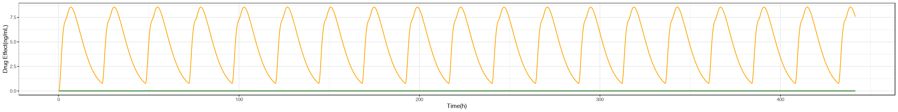


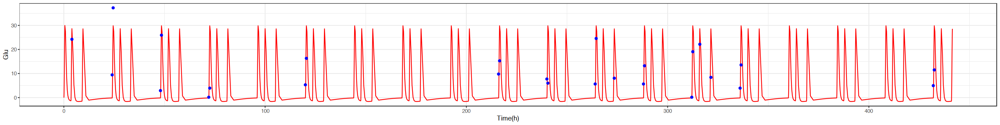


```R

```


```R
df_DPP4<-mult_drug_dosing(time_seq=t_obv,metformin_seq=metformin_dosing*0,DPP4_seq=dpp4_dosing,meal_seq=meal_dosing)

df_DPP4$x4g<-df_DPP4$x4g-df_DPP4$m3m*Vdf_glu*10/1000
```


```R
fig(24,3)

CpCe_trend <- ggplot(df_DPP4,aes(x = time)) +
  geom_line(aes(y = x3s), colour = "darkgreen") +
  geom_line(aes(y = m3m), colour = "orange") +
  ylab(label = "Drug Effect(ng/mL)") +
  xlab(label = "Time(h)") +
#   scale_colour_manual(name = "Effects",
#                       labels = c("Pop", "Ind"),
#                       values = c("red", "blue")) + 
  theme_bw()
CpCe_trend

E_trend <- ggplot(df_DPP4,aes(x = time)) +
  geom_line(aes(y = x4g), colour = "red") +
#   geom_line(aes(y = Ce, colour = "green")) +
  geom_point(aes(x = time_relative, y = Glu_g), pat_obs_data, colour = "blue", show.legend = FALSE) + 
  ylab(label = "Glu") +
  xlab(label = "Time(h)") +
#   scale_colour_manual(name = "Effects",
#                       labels = c("Pop", "Ind"),
#                       values = c("red", "blue")) + 
  theme_bw()
E_trend
```


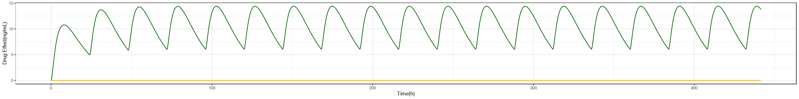


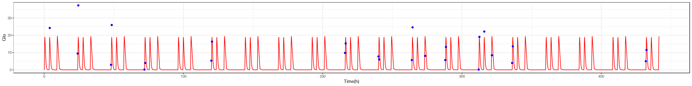


```R

```


```R
df_DPP4<-mult_drug_dosing(time_seq=t_obv,metformin_seq=metformin_dosing,DPP4_seq=dpp4_dosing,meal_seq=meal_dosing)
```


```R
df_DPP4$x4g<-df_DPP4$x4g-df_DPP4$m3m*Vdf_glu*10/1000
```


```R
fig(24,3)

CpCe_trend <- ggplot(df_DPP4,aes(x = time)) +
  geom_line(aes(y = x3s), colour = "darkgreen") +
  geom_line(aes(y = m3m), colour = "orange") +
  ylab(label = "Drug Effect(ng/mL)") +
  xlab(label = "Time(h)") +
#   scale_colour_manual(name = "Effects",
#                       labels = c("Pop", "Ind"),
#                       values = c("red", "blue")) + 
  theme_bw()
CpCe_trend

E_trend <- ggplot(df_DPP4,aes(x = time)) +
  geom_line(aes(y = x4g), colour = "red") +
#   geom_line(aes(y = Ce, colour = "green")) +
  geom_point(aes(x = time_relative, y = Glu_g), pat_obs_data, colour = "blue", show.legend = FALSE) + 
  ylab(label = "Glu") +
  xlab(label = "Time(h)") +
#   scale_colour_manual(name = "Effects",
#                       labels = c("Pop", "Ind"),
#                       values = c("red", "blue")) + 
  theme_bw()
E_trend
```


```R

```
